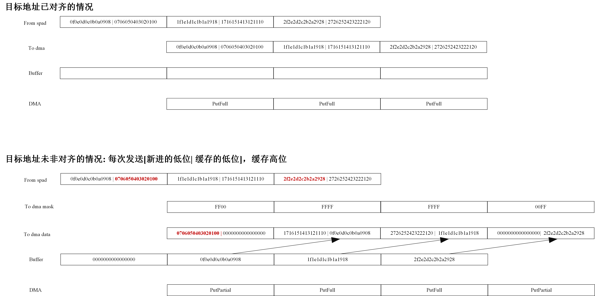

# BuckyBall


BuckyBall是一个全栈开源NPU/DSA设计框架。

## 1. 🤔 Why BuckyBall

⭐ BuckyBall框架提供一套基础设施使得开发者无需关心系统控制和内存层级等实现。

⭐ 每个单元使用统一的接口协议，易于集成，可以由顶层统一优化。

⭐ 提供多种设计模板，满足不同设计范式的同时，可以基于这些轻松定制你自己的计算单元。

⭐ BuckyBall 全栈开源，提供了丰富的workload和设计demo，从算法到编译器到RTL。

⭐ BuckyBall 提供了一套Prompt案例，助力你实现5美元定制NPU。


>❗BuckyBall 并不是某个具体的NPU设计，而是一个设计框架。你可以在example文件夹下找到各种NPU的设计案例


## 2. Architecture

### 2.1 ISA
#### 2.1.1 bb_mvin 

**功能**: 将数据从主内存加载到scratchpad内存

**func7**: `0010000` (24)

**格式**: `bb_mvin rs1, rs2`

**操作数**:

- `rs1`: 主内存地址
- `rs2[addrLen-1:0]`: scratchpad地址
- `rs2[2*addrLen-1:addrLen]`: 行数(iter) 一共有多少行
- `rs2[2*addrLen+9:2*addrLen]`: 列数 最后一行有多少列（mask），其余行均与带宽对齐

**操作**: 将主内存地址`rs1`处的数据加载到scratchpad地址`rs2[addrLen-1:0]`，执行`rs2[2*addrLen+9:addrLen]`次迭代

rs1:

```
┌─────────────────────────────────────────────────────────────────┐
│                        mem_addr                                 │
│                    (memAddrLen bits)                            │
├─────────────────────────────────────────────────────────────────┤
│                    [memAddrLen-1:0]                             │
└─────────────────────────────────────────────────────────────────┘
```

rs2:

```
┌──────────────────────────────────┬──────────────────────────────────────────┐
│        row(iter)                 │                sp_addr                   │
│     (10 bits)                    │            (spAddrLen bits)              │
├──────────────────────────────────┼──────────────────────────────────────────┤
│ [spAddrLen+9: spAddrLen]         │            [spAddrLen-1:0]               │
└──────────────────────────────────┴──────────────────────────────────────────┘
```


#### 2.1.2 bb_mvout

**功能**: 将数据从scratchpad内存存储到主内存

**func7**: `0010001` 25

**格式**: `bb_mvout rs1, rs2`

**操作数**:

- `rs1`: 主内存地址
- `rs2[addrLen-1:0]`: scratchpad地址  
- `rs2[2*addrLen+9:addrLen]`: 搬出去多少行（迭代次数）

**操作**: 将scratchpad地址`rs2[addrLen-1:0]`处的数据存储到主内存地址`rs1`，执行`rs2[2*addrLen+9:addrLen]`次迭代

rs1:

```
┌─────────────────────────────────────────────────────────────────┐
│                        mem_addr                                 │
│                    (memAddrLen bits)                            │
├─────────────────────────────────────────────────────────────────┤
│                    [memAddrLen-1:0]                             │
└─────────────────────────────────────────────────────────────────┘
```

rs2:

```
┌──────────────────────────────────┬──────────────────────────────────────────┐
│        row(iter)                 │                sp_addr                   │
│     (10 bits)                    │            (spAddrLen bits)              │
├──────────────────────────────────┼──────────────────────────────────────────┤
│   [spAddrLen+9: spAddrLen]       │             [spAddrLen-1:0]              │
└──────────────────────────────────┴──────────────────────────────────────────┘
```

#### 2.1.3 bb_mul_warp16 - 乘法指令

**功能**: 执行16-way warp的矩阵乘法运算

**func7**: `0100000` 32

**格式**: `bb_mul_warp16 rs1, rs2`

**操作数**:

- `rs1[spAddrLen-1:0]`: 第一个操作数的scratchpad地址
- `rs1[2*spAddrLen-1:spAddrLen]`: 第二个操作数的scratchpad地址
- `rs2[spAddrLen-1:0]`: 结果写回的scratchpad地址
- `rs2[spAddrLen+9:spAddrLen]`: 迭代次数

**操作**: 从scratchpad读取两个操作数，执行矩阵乘法运算，并将结果写回到指定的scratchpad地址

rs1:

```
┌────────────────────────────────┬──────────────────────────────┐
│           op2_spaddr           │          op1_spaddr          │
│       (spAddrLen bits)         │      (spAddrLen bits)        │
├────────────────────────────────┼──────────────────────────────┤
│  [2*spAddrLen-1:spAddrLen]     │ [spAddrLen-1:0]              │
└────────────────────────────────┴──────────────────────────────┘
```

rs2:

```
┌──────────────────────────┌────────────────────────────────────┐
│         iter             │    wr_spaddr                       │
│       (10 bits)          │  (spAddrLen bits)                  │
├──────────────────────────├────────────────────────────────────┤
│ [spAddrLen+9:  spAddrLen]│  [spAddrLen-1:0]                   │
└──────────────────────────└────────────────────────────────────┘
```


### 2.2 Ball 协议

所有Ball具有相同的基础属性, 具体属性会随着版本更新变化

```

```


### 2.3 数据通路




约定：
1. 所有EX指令的op1和op2不能同时访问同一个bank
2. 所有指令对scratchpad的访问不能超出该bank
3. 所有bank均为单端口(同时可读可写，应该不支持读写同一个地址(未测试))
4. 目前的bank划分，scratchpad为4个bank(64KBx4)，acc为2个bank(64KBx2)
5. acc的两个bank是弹性的，当CPU需要使用spad时，会操作acc中的bank2


## 3. simulator


## 4. workload


## 5. 工具链

### 5.1 BuddyCompiler
生成workload
```
cd voyager-test
mkdir build && cd build
cmake .. 
make -j256
```

### 5.2 内联汇编
生成workload
```
cd voyager-test
mkdir build && cd build
cmake .. 
make -j256
```

### 5.3 Spike
```
./voyager-test/scripts/build-spike.sh
./voyager-test/scripts/run-spike.sh --ext=buckyballFunc bb_mvin_mvout
```

### 5.4 Verilator
```
./voyager-test/scripts/build-verilator.sh --config BuckyBallRocketConfig --debug
./voyager-test/scripts/run-verilator.sh --config BuckyBallRocketConfig --debug  
```


### 5.5 Firesim
```

```

### 5.6 帕拉丁
```

```

### 5.7 DC
```
./voyager-test/scripts/run-dc.sh --config BuckyBallRocketConfig
```
生成报告可以使用可视化工具查看 [dc_helper](https://github.com/SEU-ACAL/tapeout-Voyager/blob/dev/voyager-test/scripts/dc_helper.ipynb)


## 6. Buckyball 设计流程
书写workload->实现模拟器->实现RTL

约定：

设计新指令必须配套对应的测试用例

设计新算子必须配套对应的测试用例


## 7. BuckyBall 验证流程
没有经过验证的代码都是错误的代码，任何功能的实现都包括两级验证：模拟器的功能对齐和RTL的正确性验证，确保编译器-模拟器-RTL的一致性。

测试集都会添加在`voyager-test/scripts/batch-test.sh`中，可以添加`--bb-test`参数来执行BuckyBall的测试用例
```
./voyager-test/scripts/batch-test.sh --bb-test
./voyager-test/scripts/batch-test.sh --bb-test --difftest=on
```


## 8. Buckyball 案例分析

